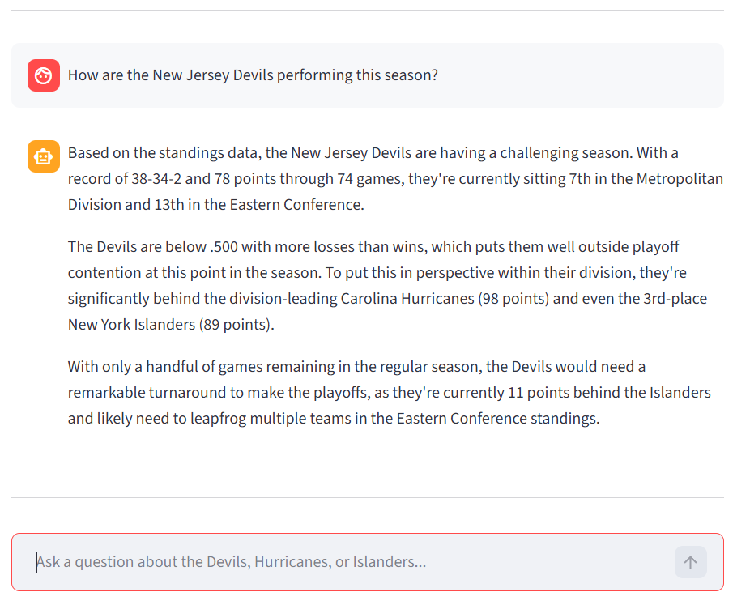
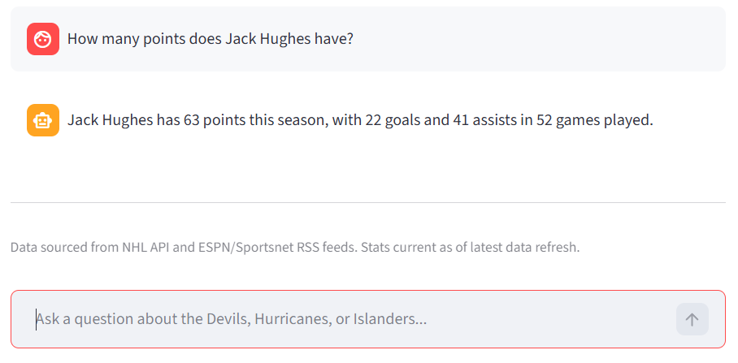
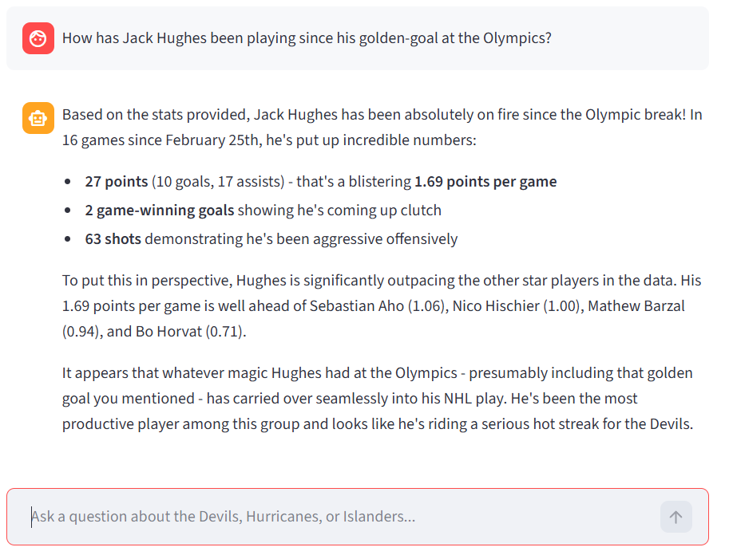
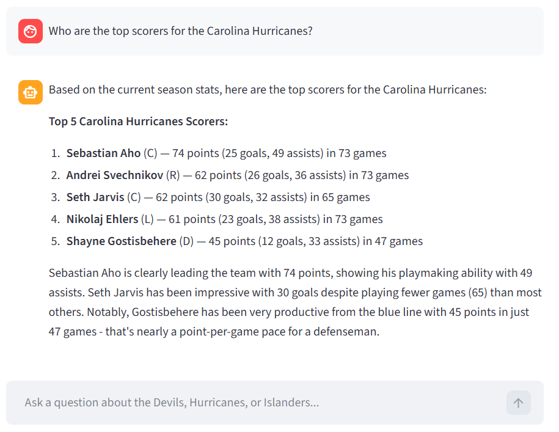

# Hockey RAG Assistant

A Retrieval-Augmented Generation (RAG) application for querying real-time NHL hockey data using natural language. Built with Python, ChromaDB, sentence-transformers, Claude API, and Streamlit.

## Screenshots

**Team Performance and Standings**


**Player Season Stats**


**Post Olympic Break Analysis**


**Top Scorers**



## Overview

This application demonstrates a production-style RAG pipeline applied to a real-world domain. It ingests live NHL data from multiple sources, processes it into semantically meaningful document chunks, embeds and stores them in a vector database, and uses Claude to generate grounded natural language answers.

Most SOTA NHL hockey apps have unfettered access to paid game log data, betting lines, practice logs, etc. This was a way to test and learn about RAG architecture while collecting and structuring the free data that is out there. 

**Supported teams:** New Jersey Devils, Carolina Hurricanes, New York Islanders

## Example Questions

- "How are the New Jersey Devils performing this season?"
- "Who are the top scorers on the Carolina Hurricanes?"
- "How many points does Jack Hughes have?"
- "How has Jack Hughes been playing since the Olympic break?"
- "What are Nico Hischier's last 10 games like?"
- "How is Sebastian Aho performing this season?"

## Architecture
```
Data Sources → Ingestion → Processing → Vector Store → Retrieval → Generation → UI
```

### Data Sources
- **NHL API** — Live standings, rosters, team stats, and player game logs
- **ESPN RSS** — Recent NHL news and analysis
- **Sportsnet RSS** — Additional NHL coverage

### Document Processing

Raw data is transformed into semantically rich text documents across several types:

- **Standings documents** — Current team records and division and conference rankings
- **Player stats documents** — Individual season statistics per player
- **Scoring summaries** — Pre-ranked top scorers per team
- **Season summary documents** — Aggregated season stats per key player
- **Post Olympic break summaries** — Performance stats since February 25 2026
- **Last 10 game summaries** — Recent form with game by game breakdown
- **Individual game log entries** — Single game performance records

### Retrieval Strategy

Pure semantic search struggles with ranked and time-filtered queries. This application uses intent detection to route queries to the appropriate document type before falling back to semantic search.

| Intent | Trigger Phrases | Document Type |
|--------|----------------|---------------|
| Team performance | "how are the", "standings", "playoff" | standings |
| Top scorers | "top scorers", "leading scorer" | scoring_summary |
| Season stats | "how many points", "this season" | season_summary |
| Olympic break | "olympic break", "since olympics" | post_olympic_summary |
| Last 10 games | "last 10", "recent form" | last_10_games |
| General | everything else | semantic search |

### Key Design Decisions

**Pre-ranked scoring summaries** — Semantic search cannot sort by points. Creating explicit ranked documents at processing time solves this cleanly without requiring a reranking model.

**Intent-aware retrieval over pure semantic search** — For structured data questions, keyword-based intent routing to filtered document types significantly outperforms embedding similarity alone.

**Sentence-transformers for embeddings** — Uses all-MiniLM-L6-v2 locally, avoiding OpenAI embedding API costs while maintaining strong retrieval quality.

**Direct component integration over LangChain abstractions** — Built the RAG pipeline using core components directly including sentence-transformers, ChromaDB Python client, and Anthropic SDK rather than relying on LangChain wrappers. This approach provides deeper understanding of each layer and more control over retrieval behavior.

**Known limitations**

  - *Structured data in a vector store* : NHL stats are inherently structured and would be more precisely served by direct SQL database queries rather than semantic search. The intent detection layer compensates for this by routing structured queries to pre-aggregated summary documents. A production system would use a hybrid architecture separating direct database queries for stats from semantic search for narrative content.
  
  - *Intent detection brittleness* : Keyword based routing works well for anticipated query patterns but falls back to generic semantic search for unanticipated phrasings. A more robust approach would use metadata filtering combined with hybrid BM25 and dense vector search.
  
  - *News content depth* : RSS feeds provide summaries only due to free tier constraints. Full article content would improve answers to narrative and context heavy questions.
  
  - *Three team coverage* : Covers Devils, Hurricanes, and Islanders only. Scaling to all 32 teams would require automated daily refresh pipelines and a persistent database backend.
  
  - *No real time data* : Data reflects the most recent manual refresh rather than live game updates.
  
  - *Post Olympic break cross player comparison* : Comparing multiple players over the same period requires both players summary documents to surface in the same retrieval window which is not guaranteed.

## Tech Stack

- **Python 3.11**
- **ChromaDB** — Local vector database
- **sentence-transformers** — Local embeddings using all-MiniLM-L6-v2
- **Anthropic Claude API** — Response generation
- **Streamlit** — Conversational UI
- **feedparser** — RSS ingestion
- **NHL API** — Live hockey data

## Setup

### Prerequisites
- Python 3.11+
- Anthropic API key

### Installation
```bash
git clone https://github.com/ehale06/hockey-rag
cd hockey-rag
python -m venv venv
venv\Scripts\activate
pip install -r requirements.txt
```

### Configuration

Create a .env file:
```
ANTHROPIC_API_KEY=your_anthropic_api_key_here
```

### Run
```bash
# Step 1 — Ingest data from NHL API and RSS feeds
python src/ingest.py

# Step 2 — Process raw data into document chunks
python src/process.py

# Step 3 — Build vector store
python src/retrieval.py

# Step 4 — Launch the app
streamlit run src/app.py
```

## Project Structure
```
hockey-rag/
├── src/
│   ├── ingest.py        # Data ingestion from NHL API and RSS
│   ├── process.py       # Document processing and chunking
│   ├── retrieval.py     # Vector store and intent-aware retrieval
│   ├── rag_chain.py     # Claude integration and RAG chain
│   └── app.py           # Streamlit UI
├── screenshots/         # Application screenshots
├── data/                # Raw and processed data (gitignored)
├── .chroma/             # ChromaDB vector store (gitignored)
├── .env.example         # Environment variable template
├── requirements.txt     # Dependencies
└── README.md
```

## Data Refresh

Re-run the pipeline to fetch fresh data:
```bash
python src/ingest.py
python src/process.py
python src/retrieval.py
```
